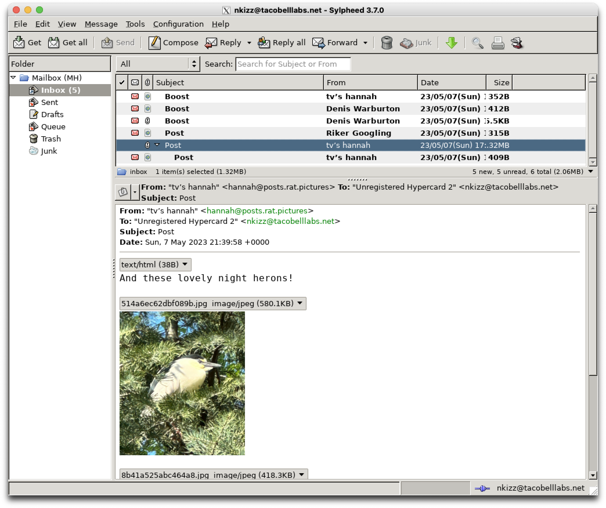
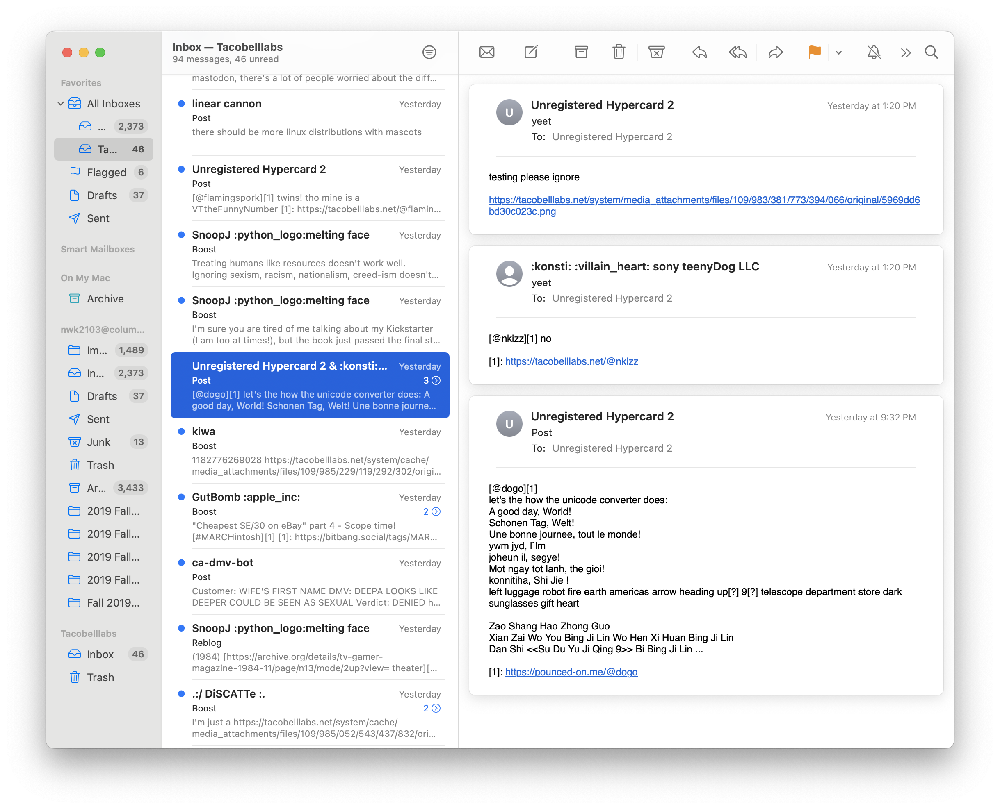

# MOP3
A Mastodon to email client Gateway

MOP3 is a toy-ish, standards complient-ish server that speaks POP3/SMTP which serves data from your home Mastodon timeline. This enables email clients from as early as the 1980s and as recent as today to receive, send, and reply to Mastodon posts (including images). This was started as a retro-computing project, however I've used it as my main client during development, as even modern email clients like Apple's Mail.app and Windows Mail support POP3 and SMTP. MOP3 can be configured to encode posts in Unicode or ASCII, with or without HTML, and images either as links, or attachments.

## Installation
Binaries are available for Windows, Mac, and Linux on the releases page. This is written in Rust, so running `cargo install mop3` on your host should install it. If not, downloading the repo and running `cargo build` should also work. 

## Usage
This requires an access token, which can be obtained in Preferences -> Development -> New Application on your Mastodon account. The client key and secret are _not_ required.

`mop3 --help` will give you all of the important runtime flags. None are required, but `--token` is reccomended to avoid sending your access token over TCP, and required for posting since SMTP authentication is not implemented. I reccomend the `--ascii` flag for retro clients, and `--html --inline` for modern clients.

To connect to it, point your client at the server ip/port, set the username to "username@instance.com", the password to your account token, and disable SSL/TLS/SPA/SMTP authentication. If `--token` is used, the password can be anything. Some clients will not include the domain name in the username by default, so make sure it includes both parts, and use `--user` if all else fails.

I strongly reccomend turning OFF "Include Original Message"/"Inline reply" and similar settings in your client, as it is very difficult to parse when the reply ends and the original message starts, and the parsing code will often post headers in your mastodon message by mistake.

On the first connection, MOP3 will fetch the last 40 posts on your timeline. On every subsequent connection, it will only fetch the posts that have been uploaded since the last connection. This can't differentiate between clients, so the server will need to be restarted to refetch posts on a new client.

## Disclaimer
You run this application _at your own risk_. MOP3 is my first Rust application, and so probably contains code slightly below world class levels. It is also speaking a protocol from the 90s/70s, with no security, and little authentication. I don't reccomend running this on the internet. I also tried to be friendly with my use of the Mastodon API, but I'm not responsible for any DMs from your sysop if it does something weird. However, the code is relatively simple, it's been tested, and especially with the `--token` option, not passing around secret data, so it _should_ be perfectly safe to run on a LAN.

